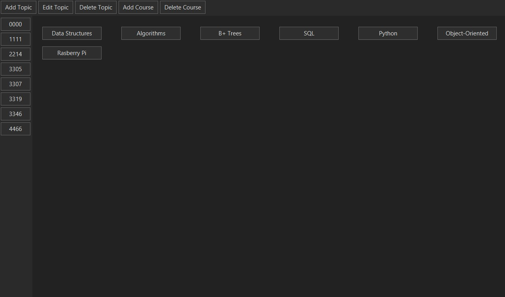
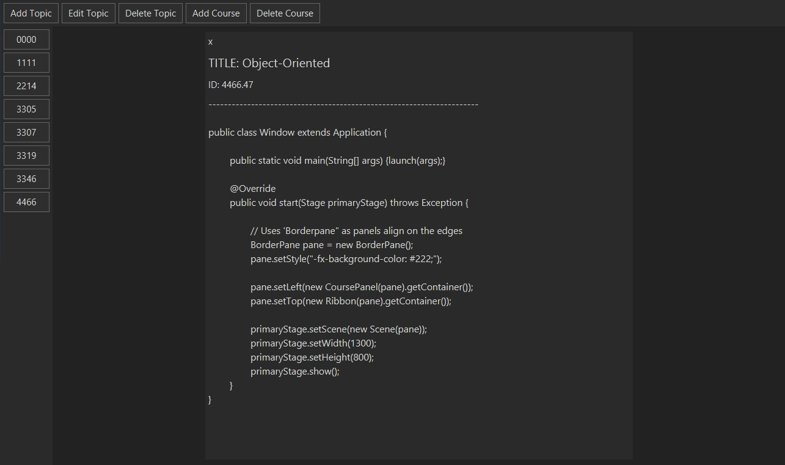

# NoteBoard
TECHNICAL SKILLS APPLIED:
- Practiced designed, implementation and debugging
- Used object-oriented programming and Java
- Learned to use JavaFx (Java GUI Library)
- Learned to adjust navigation, visuals for a better user-experience

- //

DESCRIPTION: 
- I use this app for school, so the left panel are the courses ID's and center buttons are the notes

Author: Jadd
Date: Nov 25, 2020
